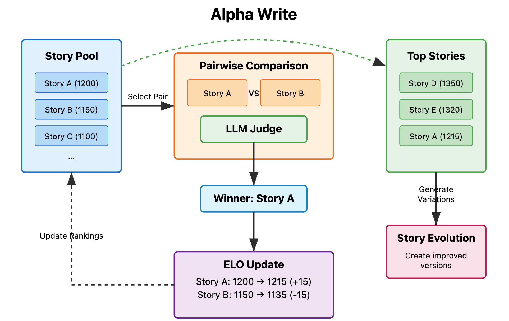

# AlphaEvolve Writing



You can find the full explanation [here](https://tobysimonds.com/research/2025/06/06/LLM-Self-Rewarding-copy.html)

You can find a sample story submitted to a writting comp [here](https://blog.reedsy.com/short-story/wo9iuy/#comments)

A modern, evolutionary writing system that uses AI models to generate, evaluate, and evolve creative stories or general writing pieces through iterative competitions. Built with clean, modular Python architecture following modern design principles.


## ✨ Features

- 🧬 **Evolutionary Algorithm**: Stories evolve through AI-powered tournaments
- 🎯 **Dual Writing Modes**: Creative storytelling and general writing optimization
- 🏆 **ELO Tournament System**: Sophisticated ranking through pairwise comparisons
- 🌐 **Web Interface**: Human validation and story comparison tools
- 🔧 **Configurable**: Extensive customization through JSON configuration

## 🚀 Quick Start

### Installation

```bash
# Clone the repository
git clone https://github.com/your-org/alphaevolve-writing
cd alphaevolve-writing

# Install with uv (recommended)
uv sync

# Or install with pip
pip install -e .

# Configure your API keys (see Configuration section below)
```

### Run Evolution

```bash
# Run 5 evolution iterations
python evolve.py 5

# Fresh start with 3 iterations
python evolve.py 3 --fresh

# Use general writing mode
python evolve.py 5 --general

# Show help
python evolve.py --help
```

## 🏗️ Architecture

The system follows modern Python design principles with clean separation of concerns:

```
├── src/
│   ├── core/           # Pipeline orchestration
│   │   └── pipeline.py # Main EvolutionPipeline class
│   ├── generators/     # Story generation logic
│   │   ├── story_generator.py      # Initial & next batch generators
│   │   ├── generate_response.py    # Creative writing generation
│   │   ├── generate_response_general.py # General writing generation
│   │   └── judge_response.py       # AI judging system
│   ├── rankers/        # ELO ranking system
│   │   ├── elo_rank.py            # Core ELO algorithm
│   │   └── tournament_runner.py    # Tournament management
│   └── utils/          # Utility functions
│       └── inference.py           # Multi-provider LLM interface
├── evolve.py           # Clean CLI entry point
├── pyproject.toml      # Modern Python packaging
├── config.json         # Configuration
└── web_interface/      # Web UI for validation
```

### Key Components

- **`EvolutionPipeline`**: Main orchestrator that manages the complete evolution cycle
- **`InitialStoryGenerator`**: Creates the first generation of stories from prompts
- **`NextBatchGenerator`**: Evolves top performers into improved variants
- **`TournamentRunner`**: Manages ELO tournaments for story ranking
- **`EloRankingSystem`**: Implements sophisticated ranking algorithm

## 📖 How It Works

The system follows a three-stage evolution cycle:

### 1. **Generate Initial Batch**
- Creates multiple stories from your prompt
- Uses configurable AI models (GPT, Claude, Llama, etc.)
- Assigns initial ELO ratings

### 2. **Run ELO Tournament**
- Stories compete in pairwise comparisons
- AI judges evaluate based on your rubric
- ELO ratings updated based on wins/losses

### 3. **Generate Next Batch**
- Top-performing stories selected
- Variants generated with improvements
- Process repeats for multiple generations

This iterative process evolves increasingly better writing over time.

## ⚙️ Configuration

### Basic Setup

Edit these key files:

- **`prompt.txt`** - Your writing prompt/theme
- **`rubric.txt`** - Judging criteria for evaluation
- **`config.json`** - System configuration

### API Keys Setup

The system supports multiple AI providers configured through `config.json`. The configuration maps models to providers and specifies which environment variables contain the API keys:

```json
{
  "llm_providers": {
    "openai": {
      "type": "openai",
      "base_url": "https://api.openai.com/v1",
      "api_key_env": "OPENAI_API_KEY"
    },
    "anthropic": {
      "type": "anthropic", 
      "api_key_env": "ANTHROPIC_API_KEY"
    },
    "deepinfra": {
      "type": "openai_compatible",
      "base_url": "https://api.deepinfra.com/v1/openai",
      "api_key_env": "DEEPINFRA_API_KEY"
    },
    "deepseek": {
      "type": "openai_compatible",
      "base_url": "https://api.deepseek.com/v1",
      "api_key_env": "DEEPSEEK_API_KEY"
    },
    "gemini": {
      "type": "openai_compatible",
      "api_key_env": "GEMINI_API_KEY",
      "base_url": "https://generativelanguage.googleapis.com/v1beta/openai/"
    }
  },
  "model_provider_mapping": {
    "gpt-4": "openai",
    "gpt-3.5-turbo": "openai", 
    "claude-3-sonnet-20240229": "anthropic",
    "meta-llama/Meta-Llama-3-70B-Instruct": "deepinfra",
    "deepseek-chat": "deepseek",
    "gemini-2.5-flash": "gemini"
  }
}
```

Then set your API keys as environment variables:

```bash
export OPENAI_API_KEY="your-openai-key"        # For GPT models
export ANTHROPIC_API_KEY="your-anthropic-key"  # For Claude models  
export DEEPINFRA_API_KEY="your-deepinfra-key"  # For Llama models
export DEEPSEEK_API_KEY="your-deepseek-key"    # For DeepSeek models
export GEMINI_API_KEY="your-gemini-key"          # For Gemini models
```

You only need to set keys for the providers you plan to use. The system automatically routes model requests to the correct provider based on the configuration.

### Configuration Options

The `config.json` file controls all system behavior:

```json
{
  "batch_generation": {
    "num_stories": 10,
    "model": "gpt-4",
    "initial_elo": 1500
  },
  "elo_ranking": {
    "tournament_rounds": 50,
    "judge_model": "claude-3-sonnet-20240229",
    "k_factor": 32
  },
  "next_batch_generation": {
    "top_stories_to_select": 3,
    "variants_per_story": 2,
    "include_original_stories": true
  },
  "evolution_pipeline": {
    "max_iterations": 5,
    "auto_continue_from_existing": true
  }
}
```

## 🎭 Writing Modes

### Creative Writing Mode (Default)
- Focuses on storytelling, character development, and narrative techniques
- Uses mission-based generation strategies
- Optimizes for creativity and engagement

### General Writing Mode (`--general`)
- Focuses on academic papers, essays, reports, and professional writing
- Uses analytical and structured approaches
- Optimizes for clarity and persuasiveness

## 🔧 Advanced Configuration

### Customizing Generation Strategies

For advanced users, you can customize the generation prompts, author styles, and mission sets by editing the files in the `src/generators/` directory:

#### Creative Writing Customization (`src/generators/generate_response.py`)

**Mission Sets** - Define creative approaches and goals:
```python
mission_sets = {
    "emotional_depth": [
        "Focus on the psychological depth of characters",
        "Explore complex emotional landscapes", 
        "Create moments of genuine human connection"
    ],
    "narrative_craft": [
        "Experiment with unique narrative structures",
        "Use vivid, sensory descriptions",
        "Create compelling story arcs"
    ],
    "dialogue_mastery": [
        "Write authentic, character-specific dialogue",
        "Use subtext and implied meaning",
        "Balance dialogue with action and description"
    ]
}
```

**Author Styles** - Emulate different writing approaches:
```python
author_styles = [
    "Write with the psychological insight of Virginia Woolf",
    "Adopt the sparse, powerful prose of Ernest Hemingway", 
    "Use the magical realism style of Gabriel García Márquez",
    "Employ the detailed world-building of Tolkien"
]
```

#### General Writing Customization (`src/generators/generate_response_general.py`)

**Academic Focus Areas** - Target specific writing domains:
```python
academic_focuses = [
    "Rigorous analytical argument development",
    "Clear thesis statement and supporting evidence",
    "Proper academic citation and source integration",
    "Logical flow and coherent structure"
]
```

**Writing Approaches** - Define analytical strategies:
```python
writing_approaches = [
    "Comparative analysis with multiple perspectives",
    "Problem-solution framework with evidence",
    "Cause-and-effect reasoning with examples",
    "Critical evaluation with balanced arguments"
]
```

### Customizing Judge Criteria (`src/generators/judge_response.py`)

You can modify the judging criteria and evaluation prompts to focus on specific aspects of writing quality:

```python
# Edit the judge_responses function to customize evaluation criteria
evaluation_criteria = [
    "Technical writing proficiency",
    "Creative originality and innovation", 
    "Emotional impact and reader engagement",
    "Structural coherence and flow",
    "Character development and authenticity"
]
```

### Tips for Advanced Configuration

1. **Backup Original Files**: Always keep copies of the original generator files before making changes
2. **Test Incrementally**: Make small changes and test with a few iterations before running full evolution cycles
3. **Monitor Results**: Use the web interface to validate that your customizations improve story quality
4. **Mix and Match**: Combine different mission sets and author styles for unique generation strategies
5. **Version Control**: Track your customizations with git to revert if needed

This modular approach allows you to fine-tune the evolution process for your specific writing goals and domains.

## 🌐 Web Interface

Validate your evolution results with the built-in web interface:

```bash
cd web_interface
pip install -r requirements.txt
python app.py
```

Open http://localhost:5000 to access:

- **Story Comparison**: Side-by-side reading and preference selection
- **ELO Rankings**: View current standings and statistics
- **Evolution Tracking**: Validate that later generations improve
- **Data Export**: Download results for analysis

## 🧪 Development

### Package Structure

Install in development mode:

```bash
pip install -e .[dev]
```

### Code Quality

The project includes modern development tools:

```bash
# Format code
black src/

# Sort imports
isort src/

# Lint code
flake8 src/

# Type checking
mypy src/
```

### Testing

```bash
pytest tests/
```

## 📦 Installation Methods

### Using uv (Recommended)
```bash
uv sync
uv run evolve.py 5
```

### Using pip
```bash
pip install -e .
python evolve.py 5
```

### Using Docker
```bash
docker build -t alphaevolve-writing .
docker run -it alphaevolve-writing evolve.py 5
```
